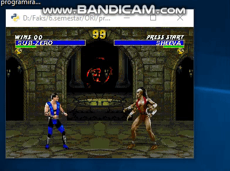
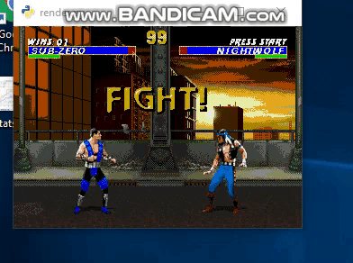
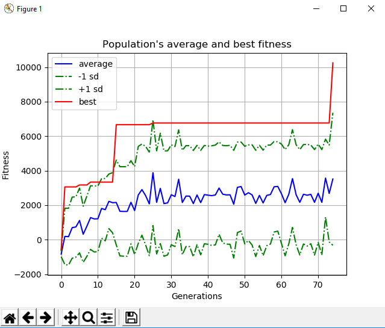

## ORI-2019-NEAT-MortalKombat3

This is code for training bots to play Mortal Kombat 3 for Genesis using NEAT-python and gym-retro liberty

# Required libertys

To use this project you need to install following python libertys:

1.gym-retro
2.numpy
3.opencv
4.python-neat

# Usage

Before runig any of this moduls you need to add states to gym-retro's site-package in "data\stable\MortalKombat3-Genesis" folder, states that i used are in "playGame/states". You also need to provide game rom that i have no rights to and can not publish. 

To train new network you need to change file to witch final network will be saved in "neat_mortal.py" and then run it. (not changing file will override last saved network). Do to limitation on my device i could train only on tree stats at the time. If you wish to do more you cant change states list in "neat_mortal.py" 

To see results of traning network change runing file in "play.py" and run it. You also can change state to which one you want to start game from.

# Results

Do to limitation on my device i can only geave weak examples. 

I managed to train networks that can always win matches that they where trind for. 

 
sub-zero-winner6.bin

 
sub-zero-winner5.bin

But when it comes to fighting oponents that i didnt train network to fight result is unpridcitible:

 
sub-zero-winner6.bin
 

Network sub-zero-winner6.bin was traind on "sub-zero-mid1", "sub-zero-mid2", "sub-zero-hard1" states and it took over 36h and over 70 generations for me.

 
